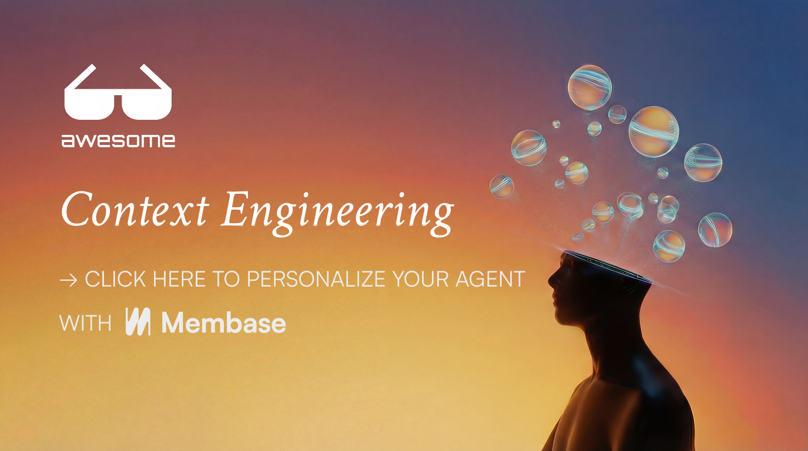

<div align="center">

# Awesome Context Engineering

[](https://membase.so/?utm_source=github&utm_medium=awesome-context-engineering)

[](https://awesome.re)
[](CONTRIBUTING.md)
[](LICENSE)

[](https://x.com/mem_base)
[](https://www.linkedin.com/company/aristotechnologies)
[](https://discord.com/invite/vRp5Zh3HGu)

</div>

> A curated list of resources for making AI agents **truly understand you** through **Context Engineering**.

---

## What is Context Engineering?

**Context Engineering** is the practice of systematically providing AI with information about yourself—your preferences, documents, history, and workflows—to transform a generic AI assistant into one that truly understands you.

### The Problem

Every time you start a conversation with AI, it knows nothing about you:
- It doesn't know your coding style or tech stack
- It doesn't remember what you discussed yesterday
- It can't access your notes, documents, or data
- It treats you the same as millions of other users

### The Solution

Context Engineering solves this by injecting **your personal context** into AI interactions:

```
Your Context (what makes AI understand YOU)
├── Instructions: "I prefer TypeScript, be concise"
├── Background: Your role, expertise, current projects
├── Documents: Your notes, files, code
├── Memory: Facts AI learned about you over time
└── Connected Apps: Your Notion, Slack, email, calendar
```

### Key Resources

- [Effective Context Engineering for AI Agents](https://www.anthropic.com/engineering/effective-context-engineering-for-ai-agents) - Anthropic's engineering blog
- [Context Engineering in Agents: Memory Patterns](https://medium.com/agenticais/context-engineering-in-agent-982cb4d36293) - Memory patterns guide
- [Building Personal Context](https://www.reddit.com/r/ClaudeAI/comments/1j6q49b/building_an_ai_agent_with_a_bank_of_personal/) - Reddit discussion

---

## Contents

- [Level 1: Platform Settings](#level-1-platform-settings)
- [Level 2: Connecting Your Data](#level-2-connecting-your-data)
- [Level 3: Personal Memory](#level-3-personal-memory)
- [Level 4: Personal AI Stack](#level-4-personal-ai-stack)
- [All-in-One Solution](#all-in-one-solution)
- [Papers](#-papers)
- [Resources](#resources)

---

## Level 1: Platform Settings

> Basic personalization using built-in features. Takes 5 minutes.

### ChatGPT

**Documentation:**
- [Custom Instructions Guide](https://help.openai.com/en/articles/8096356-custom-instructions-for-chatgpt) - Official guide
- [Memory Feature FAQ](https://help.openai.com/en/articles/8590148-memory-faq) - How ChatGPT remembers you
- [Custom GPTs](https://help.openai.com/en/articles/8554397-creating-a-gpt) - Build personalized GPT

**Examples & Templates:**
| Resource | Description |
|----------|-------------|
| [Awesome ChatGPT Prompts](https://github.com/f/awesome-chatgpt-prompts) | 1000+ prompt templates |
| [ChatGPT Custom Instructions Examples](https://github.com/spdustin/ChatGPT-AutoExpert) | AutoExpert system for better responses |
| [Mr. Ranedeer AI Tutor](https://github.com/JushBJJ/Mr.-Ranedeer-AI-Tutor) | Personalized learning GPT |

### Claude

**Documentation:**
- [Claude Projects](https://support.anthropic.com/en/articles/9519177-how-can-i-create-and-manage-projects) - Project-based context
- [Custom Instructions](https://support.claude.com/en/articles/10185728-understanding-claude-s-personalization-features) - Personalization features
- [Claude Prompt Library](https://docs.anthropic.com/en/prompt-library/library) - Official prompt examples

**Examples & Templates:**
| Resource | Description |
|----------|-------------|
| [Anthropic Cookbook](https://github.com/anthropics/anthropic-cookbook) | Official examples and recipes |
| [Claude Engineer](https://github.com/Doriandarko/claude-engineer) | Engineering assistant setup |

### Cursor

**Documentation:**
- [Rules for AI](https://docs.cursor.com/context/rules-for-ai) - Official documentation
- [Context Guide](https://docs.cursor.com/context/) - Understanding cursor context

**Examples & Templates:**
| Resource | Description |
|----------|-------------|
| [cursor.directory](https://cursor.directory/) | 1000+ community cursor rules |
| [Awesome CursorRules](https://github.com/PatrickJS/awesome-cursorrules) | Curated rules collection |
| [Cursor Rules by Pontus](https://github.com/pontusab/cursor.directory) | Source for cursor.directory |
| [Cursor Rules Collection](https://github.com/sanjeed5/awesome-cursor-rules) | Another curated collection |

### GitHub Copilot

**Documentation:**
- [Copilot Customization](https://docs.github.com/en/copilot/customizing-copilot) - Official docs
- [Custom Instructions](https://docs.github.com/en/copilot/customizing-copilot/adding-custom-instructions-for-github-copilot) - Adding instructions

**Examples:**
| Resource | Description |
|----------|-------------|
| [Copilot Instructions Examples](https://github.com/github/copilot-instructions-examples) | Official examples (if available) |

### Gemini

**Documentation:**
- [Gemini Extensions](https://support.google.com/gemini/answer/13695044) - Connect Google services
- [Gems (Custom Gemini)](https://support.google.com/gemini/answer/14575153) - Create personalized Gemini

---

## Level 2: Connecting Your Data

> Give AI access to your files, notes, and apps.

### Model Context Protocol (MCP)

**Documentation:**
- [MCP Documentation](https://modelcontextprotocol.io/) - Official docs
- [MCP Announcement](https://www.anthropic.com/news/model-context-protocol) - Anthropic's blog

**Server Collections:**
| Resource | Description |
|----------|-------------|
| [Official MCP Servers](https://github.com/modelcontextprotocol/servers) | Reference implementations |
| [Awesome MCP Servers](https://github.com/punkpeye/awesome-mcp-servers) | Community servers list (800+) |
| [MCP Hub](https://github.com/nicobailey/mcp-hub) | Another server collection |

**Popular MCP Servers for Personal Use:**

| Server | What It Connects | Link |
|--------|------------------|------|
| Filesystem | Your local files | [GitHub](https://github.com/modelcontextprotocol/servers/tree/main/src/filesystem) |
| Obsidian | Your Obsidian vault | [GitHub](https://github.com/smithery-ai/mcp-obsidian) |
| Obsidian Memory MCP | Memory as markdown in Obsidian | [GitHub](https://github.com/yunaga224/obsidian-memory-mcp) |
| Obsidian Palace | Enhanced Obsidian integration | [obsidianpalace.dev](https://obsidianpalace.dev/) |
| Notion | Your Notion pages | [GitHub](https://github.com/modelcontextprotocol/servers/tree/main/src/notion) |
| Google Drive | Your Drive files | [GitHub](https://github.com/modelcontextprotocol/servers/tree/main/src/gdrive) |
| Memory | Personal knowledge graph | [GitHub](https://github.com/modelcontextprotocol/servers/tree/main/src/memory) |

**Setup Examples:**
| Resource | Description |
|----------|-------------|
| [MCP Quickstart](https://modelcontextprotocol.io/quickstart) | Official setup guide |
| [Claude Desktop MCP Config](https://modelcontextprotocol.io/quickstart/user) | Configuration for Claude Desktop |

### Browser Extensions

| Extension | Description | Link |
|-----------|-------------|------|
| **Sider** | AI sidebar with page context | [sider.ai](https://sider.ai/) |
| **Monica** | Browser AI with memory | [monica.im](https://monica.im/) |
| **Merlin** | ChatGPT on any webpage | [getmerlin.in](https://getmerlin.in/) |
| **MaxAI** | Multi-model browser AI | [maxai.me](https://www.maxai.me/) |

### Automation

| Tool | Type | Description | Link |
|------|------|-------------|------|
| **Zapier** | Cloud | Connect AI to 6000+ apps | [zapier.com](https://zapier.com/) |
| **n8n** | Self-hosted | Open-source workflow automation | [GitHub](https://github.com/n8n-io/n8n) |
| **Activepieces** | Self-hosted | Open-source Zapier alternative | [GitHub](https://github.com/activepieces/activepieces) |

---

## Level 3: Personal Memory

> AI that remembers you across conversations.

### Built-in Memory Features

| Platform | Feature | Link |
|----------|---------|------|
| **ChatGPT** | Memory (auto-learns) | [FAQ](https://help.openai.com/en/articles/8590148-memory-faq) |
| **Claude** | Projects (persistent context) | [Guide](https://support.anthropic.com/en/articles/9519177) |
| **Gemini** | Saved Info | [Help](https://support.google.com/gemini) |

### Personal Memory Services

| Service | Description | Link |
|---------|-------------|------|
| **Rewind** | Records everything on Mac, AI-searchable | [rewind.ai](https://www.rewind.ai/) |
| **Supermemory** | Memory from bookmarks, tweets, articles | [GitHub](https://github.com/supermemoryai/supermemory) |
| **Pieces** | Long-term memory across dev tools | [pieces.app](https://pieces.app/) |
| **Personal AI** | AI that learns your knowledge | [personal.ai](https://personal.ai/) |
| **Granola** | AI notepad for meetings | [granola.ai](https://www.granola.ai/) |
| **Memspan** | File-first personal memory, portable | [memspan.ai](https://memspan.ai/) |

### Self-Hosted Personal Memory

| Project | Description | Link |
|---------|-------------|------|
| **Jean Memory** | Remote personal memory for Claude | [Reddit](https://www.reddit.com/r/ClaudeAI/comments/1l17qf6) |
| **Sem-Mem** | Local semantic memory system | [Reddit](https://www.reddit.com/r/AIMemory/comments/1pg5fro) |
| **MemLayer** | Persistent memory for local LLMs | [Reddit](https://www.reddit.com/r/LocalLLaMA/comments/1ozbzpx) |
| **Basic Memory** | Personal knowledge graph system | [docs.basicmemory.com](https://docs.basicmemory.com/how-to/personal-knowledge) |
| **OpenMemory** | Rich memory with natural decay | [GitHub](https://github.com/CaviraOSS/OpenMemory) |
| **Memori** | SQL-native personal memory | [GitHub](https://github.com/GibsonAI/memori) |
| **rag-user-memories** | Extract & store personal facts | [GitHub](https://github.com/skorotkiewicz/rag-user-memories) |

### Knowledge Management with AI

| Tool | Description | Link |
|------|-------------|------|
| **Notion AI** | AI over your Notion workspace | [notion.so](https://notion.so/) |
| **Mem** | AI-powered notes | [mem.ai](https://mem.ai/) |
| **Reflect** | AI-native note-taking | [reflect.app](https://reflect.app/) |
| **Obsidian + AI** | Local notes with AI plugins | [obsidian.md](https://obsidian.md/) |
| **Reor** | Local PKM with vector search | [GitHub](https://github.com/reorproject/reor) |
| **Memos** | Self-hosted, privacy-first notes | [GitHub](https://github.com/usememos/memos) |

---

## Level 4: Personal AI Stack

> Self-hosted AI systems you fully control.

### Personal AI Assistants

| Project | Description | Link |
|---------|-------------|------|
| **Open WebUI** | ChatGPT-like UI with memory & RAG | [GitHub](https://github.com/open-webui/open-webui) |
| **Khoj** | Personal AI for your notes/docs | [GitHub](https://github.com/khoj-ai/khoj) |
| **AnythingLLM** | All-in-one document AI | [GitHub](https://github.com/Mintplex-Labs/anything-llm) |
| **Quivr** | Second brain with AI | [GitHub](https://github.com/QuivrHQ/quivr) |
| **PrivateGPT** | Fully private document chat | [GitHub](https://github.com/imartinez/privateGPT) |
| **Danswer** | AI search over your data | [GitHub](https://github.com/danswer-ai/danswer) |
| **Perplexica** | Personal AI search engine | [GitHub](https://github.com/ItzCrazyKns/Perplexica) |
| **Second Me** | AI self with hierarchical memory | [GitHub](https://github.com/mindverse/Second-Me) |
| **STING** | Privacy-first desktop AI | [stingassistant.com](https://stingassistant.com/) |
| **Tiiny AI** | Local DB from your files | [tiinyai.com](https://tiinyai.com/) |

**Setup Examples:**
| Resource | Description |
|----------|-------------|
| [Open WebUI Docker Setup](https://docs.openwebui.com/getting-started/) | Official Docker guide |
| [Khoj Self-Hosting](https://docs.khoj.dev/get-started/setup/) | Self-hosting documentation |

### Local LLM Solutions

| Tool | Description | Link |
|------|-------------|------|
| **Ollama** | Run LLMs locally | [ollama.com](https://ollama.com/) |
| **LM Studio** | Desktop LLM app | [lmstudio.ai](https://lmstudio.ai/) |
| **Jan** | Offline AI assistant | [jan.ai](https://jan.ai/) |
| **GPT4All** | Local LLM ecosystem | [gpt4all.io](https://gpt4all.io/) |
| **Llamafile** | Single-file LLM distribution | [GitHub](https://github.com/Mozilla-Ocho/llamafile) |

### Personal Knowledge Base (Vector DBs for Personal Use)

| Tool | Description | Link |
|------|-------------|------|
| **Chroma** | Easy to start, great for personal use | [GitHub](https://github.com/chroma-core/chroma) |
| **LanceDB** | Embedded, no server needed | [GitHub](https://github.com/lancedb/lancedb) |

**Tutorials:**
- [LangChain RAG Tutorial](https://python.langchain.com/docs/tutorials/rag/) - Build personal RAG
- [LlamaIndex Getting Started](https://docs.llamaindex.ai/en/stable/getting_started/concepts/) - Document AI concepts

### Document Processing

| Tool | Description | Link |
|------|-------------|------|
| **DocMind AI** | Offline document analysis with GraphRAG | [GitHub](https://github.com/BjornMelin/docmind-ai-llm) |
| **Marker** | PDF to Markdown | [GitHub](https://github.com/VikParuchuri/marker) |
| **Unstructured** | Multi-format processing | [GitHub](https://github.com/Unstructured-IO/unstructured) |

---

## All-in-One Solution

Building your own personalization stack is powerful but complex. If you want everything above in one solution:

### [Membase](https://membase.so/?utm_source=github&utm_medium=awesome-context-engineering) - Universal Memory for your Agnets

A personal memory layer that gives you:

- **Cross-agent sync**: Discuss plans with ChatGPT, then jump into Claude Code to build them without re-explaining context. Your memory follows you across all agents.

- **External context awareness**: Automatically pulls context from your calendar, Notion, Slack, and emails. Your AI knows what's happening in your life without you explicitly saying it.

- **Token efficient**: Instead of dumping everything into every session, Membase uses hybrid retrieval to inject only the relevant context for each request.

[Join the waitlist →](https://membase.so/)

---

## Resources

### Papers

**Foundational**
- [MemGPT: Towards LLMs as Operating Systems](https://arxiv.org/abs/2310.08560) - Virtual context management with tiered memory
- [Retrieval-Augmented Generation for Knowledge-Intensive NLP](https://arxiv.org/abs/2005.11401) - The original RAG paper

**Context Engineering**
- [Google's Context Engineering Whitepaper](https://www.kaggle.com/whitepaper-context-engineering-sessions-and-memory) - Official Google whitepaper on sessions and memory
- [Context Engineering 2.0](https://huggingface.co/papers/2510.26493) - Historical & conceptual grounding of context engineering
- [Agentic Context Engineering (ACE)](https://arxiv.org/abs/2510.04618) - Evolving contexts for self-improving LLMs
- [Everything is Context](https://arxiv.org/abs/2512.05470) - File system abstraction for context engineering
- [Chain of Agents](https://research.google/blog/chain-of-agents-large-language-models-collaborating-on-long-context-tasks/) - Google's framework for long-context collaboration
- [The Complexity Trap](https://arxiv.org/abs/2508.21433) - Simple observation masking vs LLM summarization for context management

**Personal Memory & Personalization**
- [USER-LLM](https://research.google/pubs/user-llm-efficient-llm-contextualization-with-user-embedding/) - Google's user embedding for LLM personalization
- [O-Mem: Omni Memory System](https://arxiv.org/abs/2511.13593) - Hierarchical memory for personalized agents
- [CUPID](https://arxiv.org/abs/2508.01674) - Evaluating personalized alignment from interactions
- [ComMer](https://arxiv.org/abs/2501.03276) - Compressing user data for personalization

**Memory Systems**
- [Memory in AI Agents: Taxonomies & Directions](https://www.emergentmind.com/papers/2512.13564) - Systematic memory classification
- [A-MEM: Agentic Memory](https://arxiv.org/abs/2502.12110) - Dynamic memory organization with Zettelkasten-style linking
- [HiMeS](https://arxiv.org/abs/2601.06152) - Hierarchical short + long-term memory
- [Second Me](https://arxiv.org/abs/2503.08102) - AI self with hierarchical memory
- [Evo-Memory](https://arxiv.org/abs/2511.20857) - Google's benchmarking of LLM agent test-time learning with self-evolving memory

**Agent Systems & Orchestration**
- [Multi-Agent Collaboration via Evolving Orchestration](https://arxiv.org/abs/2505.19591) - Evolving multi-agent collaboration patterns
- [CodeAct: Executable Code Actions Elicit Better LLM Agents](https://arxiv.org/abs/2402.01030) - Code-based agent actions

**Evaluation & Benchmarks**
- [LOCCO](https://aclanthology.org/2025.findings-acl.1014/) - Evaluating long-term memory of LLMs
- [MemoryAgentBench](https://arxiv.gg/abs/2507.05257) - Benchmarking memory via multi-turn interactions

### Articles & Blogs

- [Context Engineering for AI Agents](https://manus.im/blog/Context-Engineering-for-AI-Agents-Lessons-from-Building-Manus) - Manus's lessons from building AI agents
- [Context Rot](https://research.trychroma.com/context-rot) - Chroma's research on context degradation
- [Memory in AI Agents](https://www.philschmid.de/memory-in-agents) - Engineering long-term memory
- [Agent Memory by Letta](https://www.letta.com/blog/agent-memory) - Comprehensive memory guide
- [Recursive Language Models](https://alexzhang13.github.io/blog/2025/rlm/) - New paradigm for LLM architecture

### Related Awesome Lists

- [Awesome LLM](https://github.com/Hannibal046/Awesome-LLM) - LLM resources
- [Awesome LLM Apps](https://github.com/Shubhamsaboo/awesome-llm-apps) - LLM applications
- [Awesome AI Agents](https://github.com/e2b-dev/awesome-ai-agents) - AI agents list
- [Awesome Local AI](https://github.com/janhq/awesome-local-ai) - Local AI resources

### Community Resources

- [r/ClaudeAI](https://www.reddit.com/r/ClaudeAI/)
- [r/ChatGPT](https://www.reddit.com/r/ChatGPT/)
- [r/LocalLLaMA](https://www.reddit.com/r/LocalLLaMA/)
- [r/ObsidianMD](https://www.reddit.com/r/ObsidianMD/)
- [Cursor Forum](https://forum.cursor.com/)

---

## Contributing

Contributions welcome! Please read [CONTRIBUTING.md](CONTRIBUTING.md).

**Looking for:**
- Real examples and templates people have created
- Personal memory projects and services
- MCP servers and integrations
- Setup guides and tutorials

---

### Join the Community

- [Join our Discord](https://discord.com/invite/vRp5Zh3HGu) - Chat with other developers personalizing agents
- [Follow on Twitter](https://x.com/mem_base) - Stay updated on new updates and features
- Questions? support@aristo.so

---

<p align="center">
  <b>Join 1,300+ developers personalizing agents</b>
</p>

<p align="center">
  <a href="https://membase.so/?utm_source=github&utm_medium=awesome-context-engineering">
    
  </a>
</p>

---

## License

Apache License 2.0 - see [LICENSE](LICENSE).

[](https://opensource.org/licenses/Apache-2.0)
